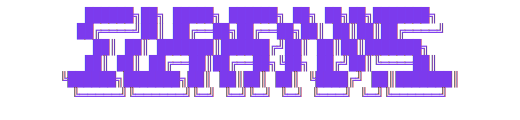

<div align="center">



*A friendly face for Claude Code*

[](https://github.com/shepardxia/Clarvis/actions/workflows/test.yml)
[](https://codecov.io/gh/shepardxia/Clarvis)

</div>

```
╭─────────╮
│  ·   ·  │  Hi! I'm Clarvis—your little window into what Claude is up to.
│    ◡    │  I sit in the corner of your screen showing status, weather,
│ ·  ·  · │  and animations while Claude thinks and works.
╰─────────╯
```

I built Clarvis because I wanted to *see* what Claude was doing—not just read terminal output. Now there's a friendly face that blinks when idle, looks focused when thinking, and shows rain or snow based on real weather outside.

## What It Does

- **Shows Claude's mood** — Idle, thinking, running tools, or waiting for you
- **Lives on your desktop** — A tiny macOS widget that stays out of the way
- **Knows the weather** — Rain and snow particles fall based on actual conditions
- **Controls your Sonos** — Ask Claude to play music, and it just works

## Get Started

```bash
./scripts/setup.sh    # Set up the MCP server
```

Then restart Claude Code and run the widget:

```bash
./ClarvisWidget/ClarvisWidget &
```

Want accurate location? `brew install corelocationcli`

## How It's Built

```
central_hub/
├── server.py          # MCP server entry point
├── core/              # Hub data, cache, time utilities
├── services/          # Weather, location, Sonos, thinking feed
└── widget/            # ASCII renderer, display service
```

## Credits

Thinking Feed adapted from [watch-claude-think](https://github.com/bporterfield/watch-claude-think) by [@bporterfield](https://github.com/bporterfield)

## License

MIT — see [LICENSE](LICENSE)
